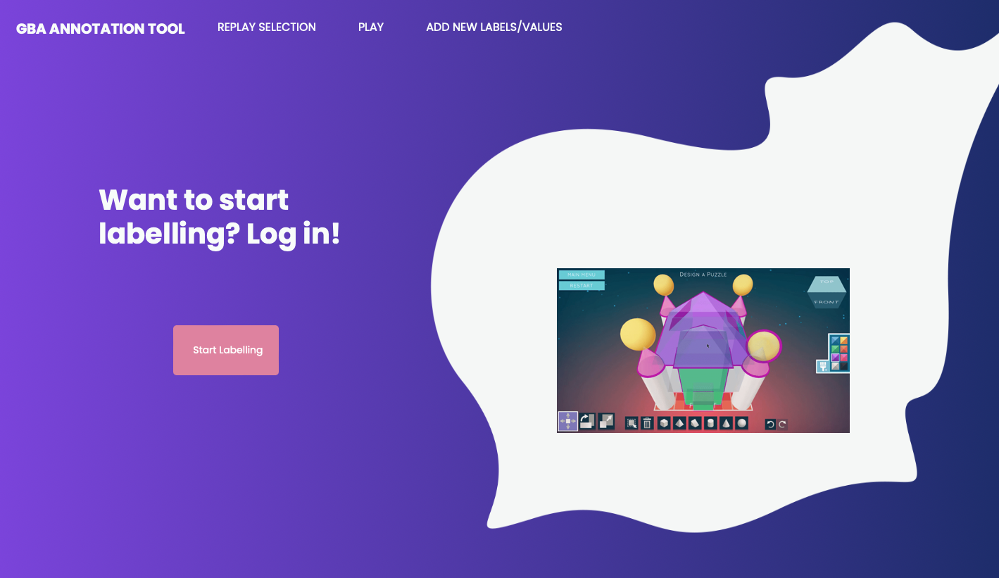
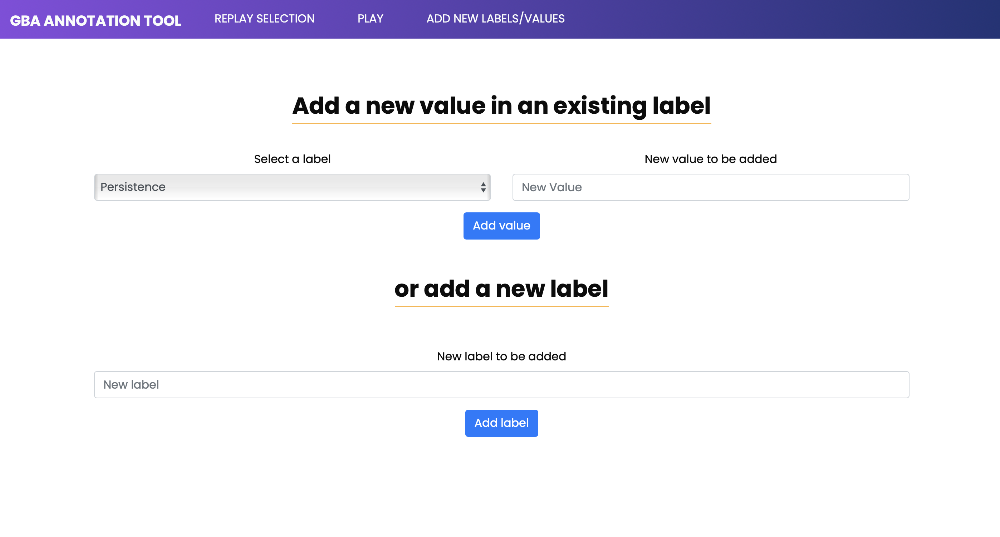

# Game-Based Assessment Labeling Tool



## Description

The Game-Based Assessment (GBA) Labeling Tool offers a versatile and adaptable solution for labeling diverse data in different scenarios within GBA. This tool supports various types of multimedia data, including audio, video, and game event data, thus providing a comprehensive understanding of learners' interactions with games.

## Key Features

- **Customizable Labels**: the tool offers labels that can be customized and adapted to the unique requirements of GBA scenarios.
- **Three Annotation Types**: users can employ three different annotation types-- global, instant-time, and window annotations-- to enhance accuracy and efficiency in data labeling.
- **Multimedia Data**: the tool supports labeling of audio, video, and game event data.
- **Game Event Data Integration**: the tool incorporates a custom parser that integrates game event data to facilitate the analysis of gameplay performance and patterns. This includes a summary of game event data, as well as the possibility to define custom events by combining existing ones along with a set of regular expression operators.
- **Unity WebGL template**: the tool includes a set of templates that offer integration with Unity WebGL applications, simplifying the process for users to incorporate their Unity projects into the labeling tool environment.
- **Data export**: each user can export their annotations in both CSV (Comma-Separated Values) and JSON (JavaScript Object Notation) formats.

## Installation

### Ubuntu & MacOS

1. Create a virtual environment:
    ```bash
    virtualenv env
    source env/bin/activate
    ```

2. Install required dependencies:

    2.1 Ubuntu
    ```bash
    sudo apt-get install libpq-dev
    pip install -r requirements.txt
    ```
    2.2 MacOS
    ```bash
    pip install -r requirements.txt
    pip install --upgrade --force-reinstall psycopg2-binary
    ```
3. Perform database migrations:
    ```bash
    python manage.py makemigrations
    python manage.py migrate
    ```

4. Initialize the database:
    ```bash
    python manage.py initdb
    ```

5. Create a user to label:
    ```bash
    python manage.py createUser user_id
    ```
   Replace `user_id` with the desired username for the user.

6. Run the server:
    ```bash
    python manage.py runserver
    ```

Once the server is running, the application should be accessible at `127.0.0.1:8000` in your web browser.

## Login

Once the labeling user has been created using the ``createUser`` command, you can login using your username in `127.0.0.1:8000/login/`. To add new labels and values, users can employ the corresponding interface at `127.0.0.1:8000/addCompetence/`:




## Adding new data

To add new data, users can access ``127.0.0.1:8000/loadReplays`` and use the upload button to add their own GBA data. Data should be compressed, and include a `JSON` file containing the name of the game and the type of data -- audioReplay, videoReplay, textReplay, ingameReplay -- being uploaded. An example is provided below:

`{"game": "game_id", "typeReplay": "audioReplay"}`

In the case of `audio` and `video` replays, a folder should be provided for each different user data. For example, if the data contains audio or video from players `player1` and `player2`, the compressed file should have two folders named `player1` and `player2`, each folder containing the multimedia data of that user.

In the case of `ingameReplay` and `textReplay` (game event data), the JSON should also contain a list with the game event files to read:

`{"game": "game_id", "typeReplay": "ingameReplay", "files": ["gameEventData1.csv", "gameEventData2.csv"]}`

For demonstration purposes, a set of audio, video, and game event data is provided in [sampleData/](sampleData/). These files are ready to be uploaded using the corresponding URL. You can find many more examples at [Open Game Data](https://opengamedata.fielddaylab.wisc.edu/index.php), an open-source and community-maintained data storage and processing pipeline for educational game data.

## Demo

[Demo video](https://youtu.be/XhGKdZfutOk)

## License

This project is licensed under the MIT License - see the [LICENSE.md](LICENSE.md) file for details.

## Contact

Manuel J. Gomez
- Website: https://www.manueljgomez.es/
- LinkedIn: [Manuel Jesús Gómez Moratilla](https://www.linkedin.com/in/manuel-jesús-gómez-moratilla-4860211a3)

## Acknowledgements

We would like to express our gratitude to [Field Day Lab](https://fielddaylab.wisc.edu) for sharing their datasets publicly, which have been used in our experiments and provided as data samples in this repository.
